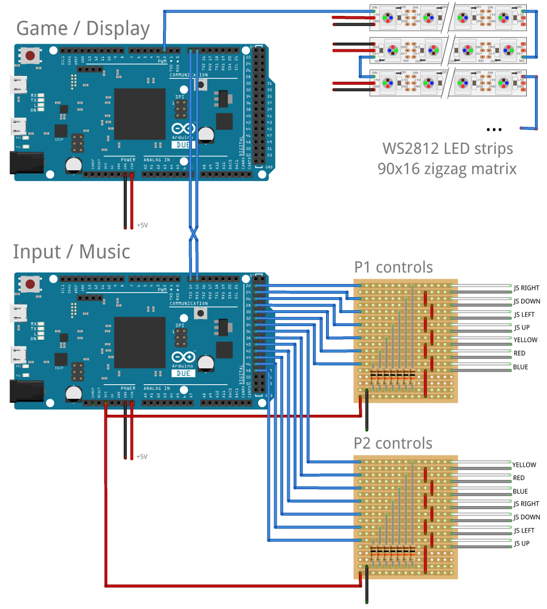

ArduinoPixels
=============

This is the Code for an Arduino based video game, originally designed by 
Kris Temmerman (@neuroprod).

See this blog post for details of the original implementation:
http://www.neuroproductions.be/arduino/arduino-video-game/

Getting started
===============

The game code can be run on an Arduino Due, using Cinder or using SDL on a Mac, Linux or Windows PC.

Arduino
-------

Prerequisites:

- 2 Arduino Due boards (one running the game, one handling input and music)
- Arduino IDE 1.5.x (must support Arduino Due)

1. Copy all folders from `libraries` into your Arduino library folder (usually `~/Arduino/libraries`).
2. Open the `PixelDisplayGame/PixelDisplayGame.ino` sketch in the Arduino IDE
3. Set Tools -> Board -> Arduino Due
4. Compile and upload the sketch to the first Arduino Due - the one that will run the display and game logic.
5. Open the `pixelGameController/pixelGameController.ino` sketch in the Arduino IDE
6. Compile and upload the sketch to the second Arduino Due - this will handle the joysticks and music playback.

Now build the hardware as described [here](#hardware) and enjoy the game!

Windows
-------

TODO

Mac
---

Prerequisites:

- XCode command line tools
- CMake
- SDL2 http://libsdl.org/download-2.0.php

Run `build.sh` to compile everything. After that, start the binary `build/PixelApp`.

Linux
-----

Prerequisites:

- A working GCC toolchain (install "build-essential" on Debian/Ubuntu)
- CMake
- SDL2 (install "libsdl2-dev")

Run `build.sh` to compile everything. After that, start the binary `build/PixelApp`.

Player Controls (SDL version)
-----------------------------

Player controls for the SDL version of the game:

- Player 1 (Boy)
    + Jump:     Arrow Up
    + Crouch:   Arrow Down
    + Left:     Arrow Left
    + Right:    Arrow Right
    + Punch:    Comma OR K
    + Kick:     Period OR L
    + Block:    Slash OR M OR Semicolon OR Minus

- Player 2 (Girl)
    + Jump:     E
    + Crouch:   D
    + Left:     S
    + Right:    F
    + Punch:    C
    + Kick:     V
    + Block:    B

Hardware
========

Display
-------

The display is a 90x16 matrix of WS2812 RGB LEDs (16 strips, 90 LEDs each).
The strips are connected in a "zigzag" configuration, that means the "DO" pad of one strip is connected to the "DI" pad of the next one. A single data line, connected to pin 2 of the Arduino, is sufficient to drive the whole display.

Power should be fed from both sides of each strip to avoid brightness falloff on one side. Depending on the brightness, the display can draw up to 60A at 5V, so a good power supply and thick cables should be used.

Player Controls
---------------

Each player has a 4-way arcade joystick and 3 buttons ("red", "yellow", "blue"), connected to Arduino pins 22 through 48 (see above diagram for the exact wiring).  All buttons need a pulldown resistor.

The two Arduinos are connected using the "Serial3" serial port (pins 14 and 15). Make sure to swap RX and TX on one side.

License
=======

The code is licensed under an MIT license, assets are licensed under Creative-Commons Attribution.

Contributors
============

- Kris Temmerman
	+ original design and implementation

- Michael Koetter 
	+ Ported to SDL2 for Linux compatibility

- Hans Robeers 
	+ Ported to CMake
	+ Removed Cinder dependency of the ClassGenerator for Linux compatibility
	+ Reduced memory footprint & increased performance by stack allocating const bitmap data
	+ Fixed memory leaks
